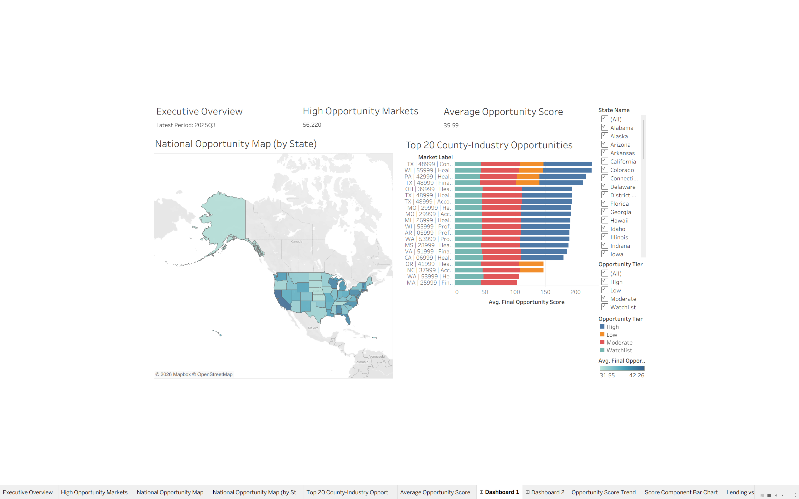
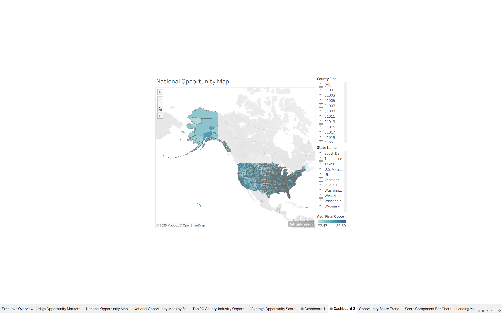
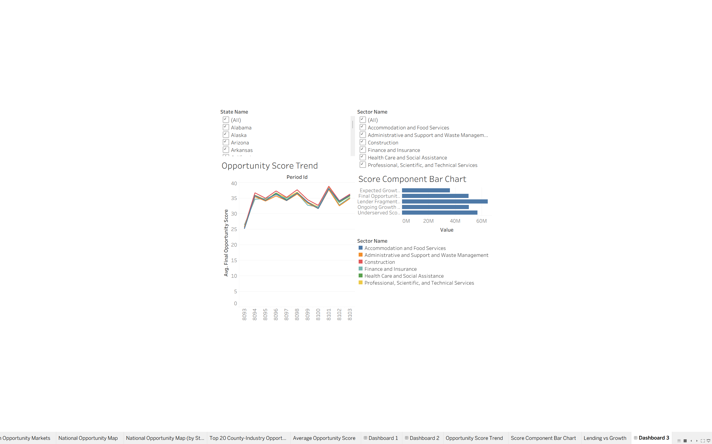
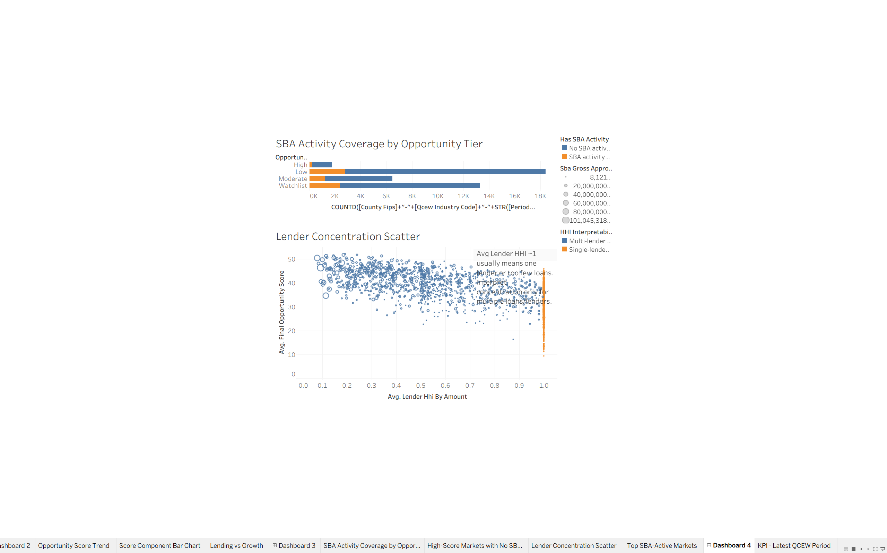
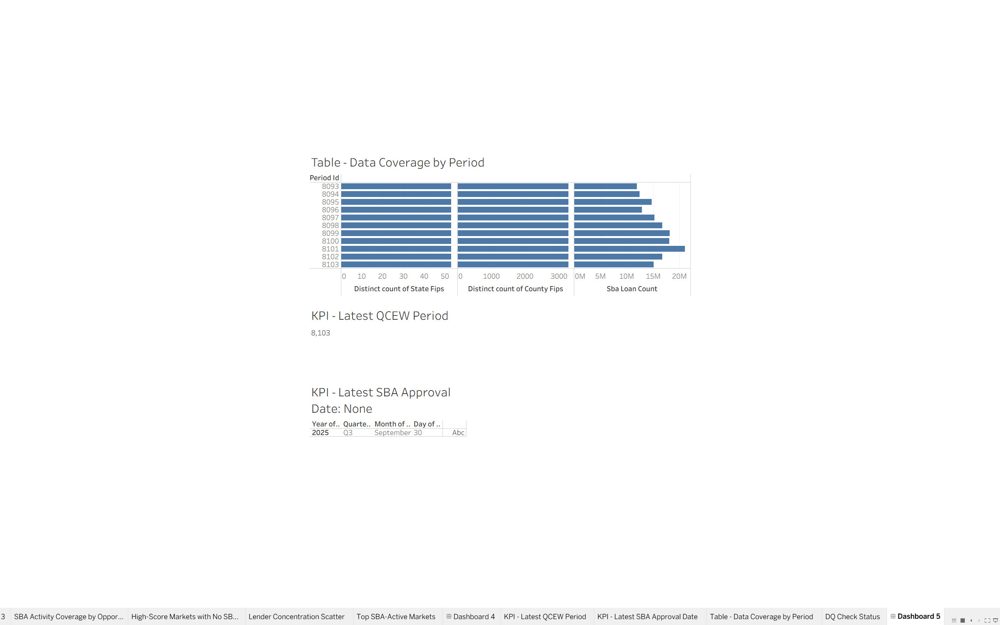

# SMB Lending & Market Opportunity Intelligence Dashboard

A production-style analytics portfolio project that uses public data to identify county-industry markets with strong SMB growth signals, weak or fragmented lending support, and actionable expansion opportunities.

## Business question

Where are the strongest SMB market expansion opportunities by county, industry, and quarter?

## Decision owner

Internal analytics consultancy / portfolio company concept.

## Core use case

Prioritize county-industry markets where public data suggests:

- SMB/local-market growth is strong or improving.
- SBA lending penetration is low relative to the establishment base.
- Lender activity is fragmented enough to suggest room for additional market entry.
- Results are interpretable for a Tableau dashboard and stakeholder memo.

This project is framed as **public-data-driven SMB lending and market opportunity intelligence**, not as a direct measurement of BI demand.

## Current scope

```text
National / all U.S. states
state_fips × county_fips × qcew_industry_code × year × quarter
```

Target industry sectors:

```text
23     Construction
52     Finance and Insurance
54     Professional, Scientific, and Technical Services
56     Administrative and Support Services
62     Health Care and Social Assistance
72     Accommodation and Food Services
44_45  Retail Trade, optional later expansion
```

## Tech stack

```text
Python
SQL
Snowflake
Snowflake CLI
Tableau
Git/GitHub
```

## Data sources

| Source | Use in project | Grain / role |
|---|---|---|
| BLS QCEW | Local market and SMB growth proxy | County × industry × quarter |
| SBA 7(a) FOIA | SMB lending activity, lender presence, concentration | Loan-level source aggregated to county × industry × quarter |
| Census county Gazetteer | County/state FIPS mapping | Reference lookup for SBA county names |
| Project reference tables | State and NAICS sector metadata | `REF.US_STATE`, `REF.NAICS_SECTOR` |

## Repository structure

```text
smb-market-intelligence/
├── data/
│   ├── raw/
│   │   ├── qcew/
│   │   └── sba/
│   └── processed/
│       ├── qcew/
│       └── sba/
├── docs/
│   ├── business_problem.md
│   ├── source_inventory.md
│   ├── metric_dictionary.md
│   ├── data_model.md
│   ├── data_quality_checks.md
│   ├── governance_privacy.md
│   ├── stakeholder_memo.md
│   ├── post_launch_review.md
│   └── tableau_dashboard_spec.md
├── notebooks/
│   ├── eda_qcew_growth.ipynb
│   ├── eda_sba_lending.ipynb
│   └── opportunity_score_validation.ipynb
├── scripts/
│   ├── download_qcew.py
│   ├── download_sba_7a.py
│   ├── prepare_sba_7a.py
│   └── run_pipeline.py
├── sql/
│   ├── 00_admin/
│   ├── 01_raw/
│   ├── 02_staging/
│   ├── 03_intermediate/
│   ├── 04_marts/
│   └── 05_dq/
├── requirements.txt
└── README.md
```

## Snowflake architecture

```text
RAW   - source-aligned or raw-normalized loaded data
STG   - cleaned typed views
INT   - intermediate analytical models
MART  - Tableau-ready final tables/views
REF   - reference tables for NAICS sectors, states, geography
DQ    - data quality checks and status views/results
OPS   - pipeline run and source freshness logs
```

Pipeline convention:

```text
RAW -> STG -> INT -> MART
      REF supports all layers
      DQ/OPS monitor all layers
```

Expected development connection:

```text
Snowflake CLI connection: smb_dev
Database: SMB_MARKET_INTELLIGENCE_DEV
Warehouse: COMPUTE_WH
Role: ACCOUNTADMIN
```

Most SQL files should include:

```sql
USE DATABASE SMB_MARKET_INTELLIGENCE_DEV;
```

## Main mart

Final Tableau-ready table:

```text
MART.COUNTY_INDUSTRY_OPPORTUNITY_QTR
```

Final mart grain:

```text
scoring_version × state_fips × county_fips × qcew_industry_code × year × quarter
```

Key metric groups:

- QCEW establishment, employment, and wage growth features.
- QCEW ongoing and expected growth scores.
- SBA loan count, approval amount, jobs supported, and active lender count.
- SBA lending penetration per establishment.
- Lender concentration and fragmentation scores.
- Underserved-market score.
- Final opportunity score and tier.

## Setup

Create and activate a virtual environment:

```bash
python3 -m venv .venv
source .venv/bin/activate
pip install -r requirements.txt
```

Confirm the Snowflake CLI connection:

```bash
snow connection test --connection smb_dev
```

## Run from scratch

Admin/reference setup:

```bash
snow sql -c smb_dev -f sql/00_admin/00_create_database.sql
snow sql -c smb_dev -f sql/00_admin/01_create_ref_tables.sql

snow sql -c smb_dev -f sql/01_raw/01_create_qcew_raw.sql
snow sql -c smb_dev -f sql/01_raw/02_create_sba_raw.sql
snow sql -c smb_dev -f sql/01_raw/03_create_load_stage.sql
```

Prepare and load QCEW:

```bash
python3 scripts/download_qcew.py \
  --state all \
  --output data/processed/qcew/qcew_county_industry_qtr_us_v1.csv

QCEW_FILE="$(pwd)/data/processed/qcew/qcew_county_industry_qtr_us_v1.csv"
snow sql -c smb_dev -q "PUT file://$QCEW_FILE @SMB_MARKET_INTELLIGENCE_DEV.RAW.LOAD_STAGE/qcew AUTO_COMPRESS=TRUE OVERWRITE=TRUE;"

snow sql -c smb_dev -f sql/01_raw/04_load_qcew_raw.sql
snow sql -c smb_dev -f sql/02_staging/01_stg_qcew_county_industry_qtr.sql
```

Prepare and load SBA:

```bash
python3 scripts/download_sba_7a.py

python3 scripts/prepare_sba_7a.py \
  --state all \
  --output data/processed/sba/sba_7a_loans_us_v1.csv

SBA_FILE="$(pwd)/data/processed/sba/sba_7a_loans_us_v1.csv"
snow sql -c smb_dev -q "PUT file://$SBA_FILE @SMB_MARKET_INTELLIGENCE_DEV.RAW.LOAD_STAGE/sba AUTO_COMPRESS=TRUE OVERWRITE=TRUE;"

snow sql -c smb_dev -f sql/01_raw/05_load_sba_raw.sql
snow sql -c smb_dev -f sql/02_staging/02_stg_sba_7a_loans.sql
```

Build intermediate and mart layers:

```bash
snow sql -c smb_dev -f sql/03_intermediate/01_int_qcew_county_industry_growth_qtr.sql
snow sql -c smb_dev -f sql/03_intermediate/02_int_qcew_growth_scores.sql
snow sql -c smb_dev -f sql/03_intermediate/03_int_sba_lending_county_industry_qtr.sql
snow sql -c smb_dev -f sql/04_marts/02_build_county_industry_opportunity_qtr.sql
```

Run data quality checks:

```bash
for file in sql/05_dq/*.sql; do
  snow sql -c smb_dev -f "$file"
done
```

Or run the Python orchestration script:

```bash
python3 scripts/run_pipeline.py --connection smb_dev
```

Useful dry run:

```bash
python3 scripts/run_pipeline.py --connection smb_dev --dry-run
```

## Validation queries

Final mart coverage:

```sql
SELECT
    COUNT(*) AS rows,
    COUNT(DISTINCT state_fips) AS states,
    COUNT(DISTINCT county_fips) AS counties,
    COUNT(DISTINCT qcew_industry_code) AS industries,
    MIN(period_id) AS min_period_id,
    MAX(period_id) AS max_period_id
FROM SMB_MARKET_INTELLIGENCE_DEV.MART.COUNTY_INDUSTRY_OPPORTUNITY_QTR;
```

Grain uniqueness:

```sql
SELECT
    scoring_version,
    state_fips,
    county_fips,
    qcew_industry_code,
    year,
    quarter,
    COUNT(*) AS rows
FROM SMB_MARKET_INTELLIGENCE_DEV.MART.COUNTY_INDUSTRY_OPPORTUNITY_QTR
GROUP BY
    scoring_version,
    state_fips,
    county_fips,
    qcew_industry_code,
    year,
    quarter
HAVING COUNT(*) > 1;
```

Latest-period top opportunities:

```sql
SELECT
    state_abbr,
    county_fips,
    sector_name,
    year,
    quarter,
    qtrly_estabs,
    ongoing_growth_score,
    expected_growth_score,
    underserved_score,
    lender_fragmentation_score,
    final_opportunity_score,
    opportunity_tier,
    sba_loan_count,
    sba_gross_approval_amount,
    top_lender_name,
    recommendation
FROM SMB_MARKET_INTELLIGENCE_DEV.MART.COUNTY_INDUSTRY_OPPORTUNITY_QTR
WHERE period_id = (
    SELECT MAX(period_id)
    FROM SMB_MARKET_INTELLIGENCE_DEV.MART.COUNTY_INDUSTRY_OPPORTUNITY_QTR
)
ORDER BY final_opportunity_score DESC
LIMIT 25;
```

## Tableau dashboard

Primary Tableau data source:

```text
SMB_MARKET_INTELLIGENCE_DEV.MART.COUNTY_INDUSTRY_OPPORTUNITY_QTR
```

Recommended dashboard pages:

1. Executive overview.
2. County-industry explorer.
3. Lending and competition.
4. Monitoring and governance.

See:

```text
docs/tableau_dashboard_spec.md
```

## Documentation

Core docs:

```text
docs/source_inventory.md
docs/metric_dictionary.md
docs/governance_privacy.md
docs/stakeholder_memo.md
docs/post_launch_review.md
docs/tableau_dashboard_spec.md
```

## Data governance notes

This project uses public datasets, but the raw SBA source can include borrower-level fields such as borrower name and location. The dashboard and stakeholder deliverables should use aggregated county-industry-quarter marts, not borrower-level displays. Raw and processed CSV files should remain out of Git.

Recommended `.gitignore` entries:

```text
data/raw/
data/processed/
*.csv
*.csv.gz
__pycache__/
.ipynb_checkpoints/
.env
.venv/
```

## Dashboard Preview

### Executive Overview


### County-level Opportunities Map


### County-Industry Explorer


### Lending & Competition


### Monitoring & Data Quality


Remaining:

- Keep post-launch review updated after dashboard publication.